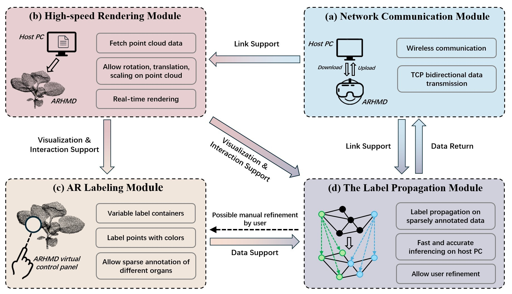
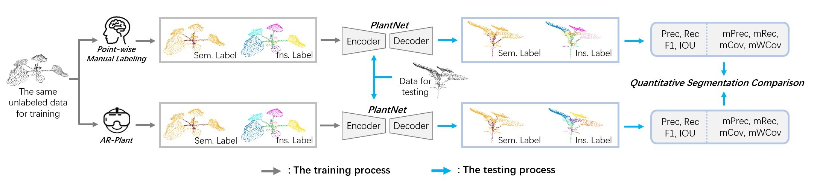
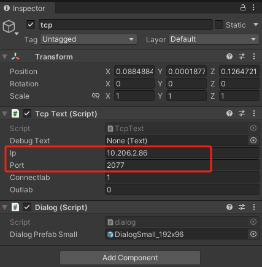

# AR-Plant: AR-based semi-automatic labeling system for 3D plant organs  
This repo contains the official codes for our paper:

### AR-Plant: AR-based semi-automatic labeling system for 3D plant organs
D. Li†, T. Li†, S. Xu, and S. Jin*
† Equal contribution

## Prerequisites
* Hololens2 HMD
* Unity == 2021.3.36f1c1
* Python == 3.11.4
* Pytorch == 2.4.0
* CUDA == 12.1

## Introduction
In current 3D crop organ point cloud labeling research, the primary challenges lie in the inefficient and labor-intensive nature of traditional PC software-based labeling processes. Complex plant structures force users to frequently manipulate the viewpoint (e.g., through translation, scaling, and rotation), severely restricting the interaction perspective and reducing labeling speed and accuracy; simultaneously, existing methods typically require fully manual, point-by-point labeling, resulting in a massive workload.

To overcome these difficulties, this study proposes the AR-Plant system. This system innovatively combines Augmented Reality (AR) technology with the semi-supervised learning paradigm of Graph Convolutional Networks (GCN). AR technology provides an immersive 3D environment and superior manipulation capabilities, enabling users to interact with and label point clouds more intuitively and efficiently; meanwhile, GCN allows users to only sparsely label a subset of points (i.e., semi-supervised), after which the system can rapidly and accurately infer labels for all organs across the entire point cloud using these sparse labels.

The AR-Plant system significantly enhances labeling efficiency, reducing the average time required to label one plant to only 53.8% of the time needed by traditional software like Semantic Segmentation Editor (SSE) and 56.7% of the time needed by CloudCompare. More importantly, with only 32.3% of points manually labeled, the system's inferred organ labels achieved a mean weighted coverage (mWCov) of 97.1%, a result approaching expert-level fully manual labeling accuracy. Furthermore, the system integrates automatic assistance strategies and features a scalable collaborative prototype, demonstrating broad application potential not only in agriculture but also in other fields.




## Quick Start
The main open-source project consists of two parts:  
a C# project for HOLOLENS2 and a Python project for the host PC.

1. **Clone the repository**
   ```sh
   git clone https://github.com/yehaaaa/AR-PLANT.git
   ```

2. **Open the project in Unity**
   - Launch Unity Hub, click "Add", and select the project folder (`AR-PLANT`).
   - It is recommended to use Unity version 2021.3.36f1c1.

3. **Install dependencies**
   - Unity will automatically install dependencies based on [Packages/manifest.json](HololensTcp/Packages/manifest.json).
   - If prompted about missing packages, click "Fix" or "Reimport".
   - For more information about the Unity HOLOLENS2 development environment, refer to: https://learn.microsoft.com/en-us/windows/mixed-reality/

4. **Set IP address and port**
   - In the Unity Editor, open the scene (usually under `Assets/Scenes` or `Assets`).
   - In the Hierarchy, select the TCP object and configure the host PC's IP address and port in the Inspector.

   - Deploy the project to HOLOLENS2. For deployment instructions, see: https://learn.microsoft.com/en-us/hololens/hololens-requirements

5. **Deploy and start the host PC application**
   - Open the `TCP+GCN` folder in your Python environment. Configure the IP address and port in `TCP.py` (must match the settings in Unity), and specify the relevant file paths.
   - Start the host application with the following command:
   ```bash
   python TCP+GCN/TCP.py
   ```

6. **Run the Unity project and start labeling**
   - On HOLOLENS2, open the HOLOLENSTCP project and click "Yes" in the pop-up window.
   - If everything is set up correctly, the original point cloud will be rendered in your view. If not, please check that the IP address is configured correctly in the previous steps.
   - Begin labeling the point cloud. (Refer to the paper for labeling methods.)

7. **FAQ**
   - If you encounter script compilation errors, ensure your Unity version and dependency packages match the requirements.
   - For special configuration needs, please refer to other documents in this repository or contact
