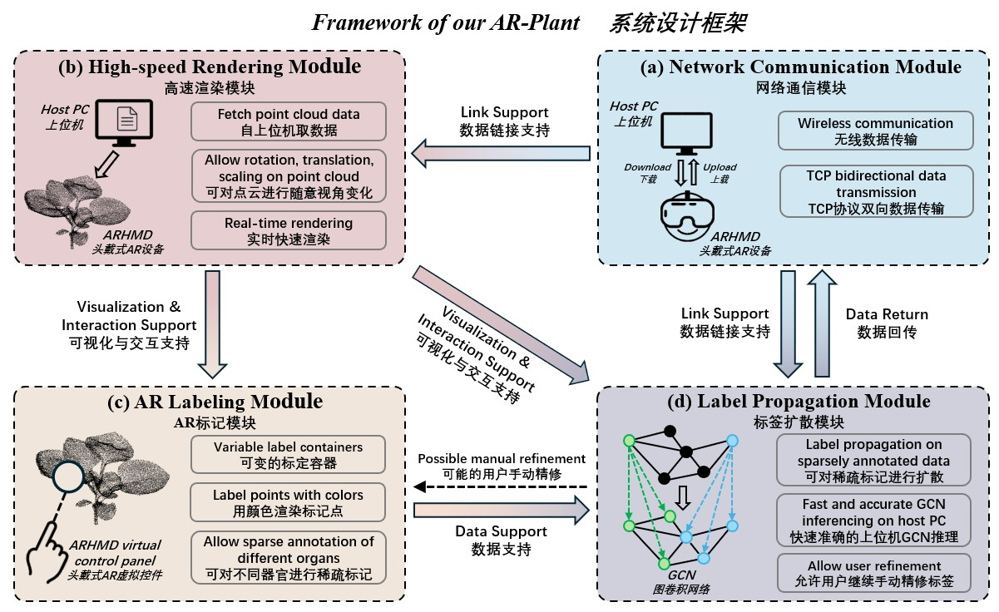

# AR-Plant: AR-based semi-automatic labeling system for 3D plant organs  
This repo contains the official codes for our paper:

### AR-Plant: AR-based semi-automatic labeling system for 3D plant organs
[D. Li†](https://davidleepp.github.io/), T. Li†, S. Xu, and S. Jin*<br>
† Equal contribution<br>
Published on *ISPRS Journal of Photogrammetry and Remote Sensing* in 2025<br>
[[Paper](https://www.sciencedirect.com/science/article/abs/pii/S0924271625003922)]
[[8-minute presentation](https://www.bilibili.com/video/BV1BgsRzhEQj)]<br>

## Prerequisites
* Hololens2 ARHMD
* PC/Workstation with an Nvidia GPU 
* Unity == 2021.3.36f1c1
* Python == 3.11.4
* Pytorch == 2.4.0
* CUDA == 12.1

## Introduction
In current 3D crop organ segmentation/phenotyping research, the primary challenges lie in the inefficient and labor-intensive nature of traditional PC software-based 3D labeling processes. Complex plant structures force users to frequently manipulate the viewpoint (e.g., through translation, scaling, and rotation), severely restricting the interaction perspective and reducing labeling speed and accuracy; simultaneously, existing methods typically require fully-manual, point-by-point labeling, resulting in a massive workload.

To overcome these difficulties, this study proposes the AR-Plant system. This system innovatively combines Augmented Reality (AR) technology with the semi-supervised learning paradigm of Graph Convolutional Networks (GCN). AR technology provides an augmented 3D environment and superior manipulation capabilities, enabling users to interact with and label point clouds more intuitively and efficiently; meanwhile, GCN allows users to only sparsely label a subset of points (i.e., semi-supervised), after which the system can rapidly and accurately infer labels for all organs across the entire point cloud using these sparse labels.

On a plant point cloud dataset, the AR-Plant system significantly enhances labeling efficiency, reducing the average time required to label one plant to only 53.8% of the time needed by a traditional software Semantic Segmentation Editor (SSE) and 56.7% of the time needed by CloudCompare. More importantly, with only 32.3% of points manually labeled, the system's inferred organ labels achieved a mean weighted coverage (mWCov) of 97.1%, a result approaching expert-level fully-manual labeling quality. Furthermore, the system integrates automatic assistance strategies and features a scalable collaborative prototype (in alpha version, not ready for release in open), demonstrating broad application potential not only in agriculture but also in other fields that processes point clouds.

In this repository, we release two different versions for AR-Plant. The first version--AR version works on an ARHMD (Hololens2) with the support of a PC/Workstation (with Nvidia GPU) as upper computer for calculation task; the second version--PC version works directly on a PC/Workstation (with Nvidia GPU) and funtions as an 3D anotation software without the ARHMD device such as Hololens2.   



## Operation Guidance


## Features

- **Dual-platform support**: Capable of annotating on PC Unity Editor or on Microsoft HoloLens2 ARHMD device
- **Semi-automatic annotation**: Semi-automatic SOM-assisted initial labeling + GCN label propagation to reduce manual annotation workload
- **Intuitive 3D interaction**: Supports point cloud rotation, scaling, and box selection
- **Automatic structural decomposition**: Automatic decomposition of segmented plant organs/parts in visualization
- **Real-time TCP communication**: Bidirectional real-time TCP communication and data transmission between PC and AR device (for AR-version)

---

## Environment Setup

### Clone the Repository

```bash
git clone https://github.com/yehaaaa/AR-PLANT.git
```

### Dependencies

- **PC**：Python 3.8+，PyTorch，NumPy，Open3D  
- **AR**：Unity 2020.3+，HoloLens development environment 

## PC Configuration

Enter the TCP+GCN folder. Main file functions:

- `TCP.py`：Main PC program for TCP communication and data transmission
- `GCN_train.py`：Main script for GCN label propagation
- `GCN_utils.py`：GCN utility functions 
- `layers.py` / `models.py`：GCN network structure definition 
- `SOM.py`：Self-Organizing Map (SOM) assisted labeling module

---

## TCP Configuration

### 1) Port Configuration

Set the port in TCP.py (default 2077), which must match the Unity project:

```python
host = '0.0.0.0'
port = 2077
```

### 2) Get Local IP (for AR configuration)

Run in Windows CMD:

```bash
ipconfig
```

Record your local IPv4 address for Unity/HoloLens connection setup.

### 3) File Path Configuration

Set point cloud paths in TCP.py:

```python
path_origin = "Your point cloud folder path"
name = "point_cloud_file_name.txt"
path_tem = "Temporary save path"
path_gcn = "GCN result save path"
```

### 4) Start Service

```bash
python TCP.py
```

Service starts successfully when you see:

- `Server started, waiting for client connection`

---

## AR Project (Unity / HoloLens) Configuration

1. Open the HololensTcp folder and import the Unity project
2. In the communication script, enter:
   - PC IP address
   - Port: 2077
3. Build and run to connect to the PC

---

## Annotation Workflow

1. Launch Unity or HoloLens2 application and establish a TCP connection
2. After loading the point cloud, adjust the viewing angle via view controls for better manipulation
3. Click "Tagging" to enable the annotation tool, and drag the slider to adjust the annotation box size
4. Use "LabelChange" to switch label index (categories); use "ModChange" to switch between SOM/pure-manual mode
5. Select the point cloud area with the annotation widget and click "Tagging" to do labeling of all points inside that widget.
6. Click "SendData" to send sparsely annotated point cloud data to the upper PC/Workstation
7. The PC/Workstation automatically performs GCN-based label propagation
8. Click "ReceiveData" to receive the fully-annotated results from PC/Workstation
9. Click "Decompose" to perform automatic plant structural decomposition

---

## Button Functions

- **Tagging**：Perform annotation  
- **Bound On/Off**：Show / hide point cloud bounding box 
- **SendData**：Send partially annotated data to PC/Workstation
- **ReceiveData**：Receive results after GCN propagation  
- **Decompose**：Plant structure decomposition  
- **ModChange**：Switch annotation mode (SOM / Manual)  
- **LabelChange**：Switch label index

---

## Notes

- PC and AR device must be on the same local network
- Ensure the IP address and port number match, otherwise connection will fail  
- It is recommended to use SOM-assisted labeling first, then conduct manual correction for better efficiency and accuracy  
- If connection errors occur, try restarting TCP.py and the Unity project 

