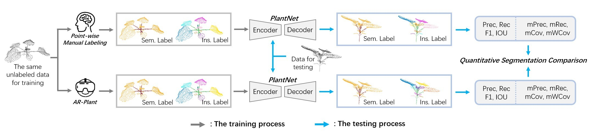
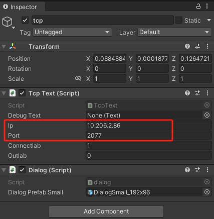

# AR-Plant: AR-based semi-automatic labeling system for 3D plant organs  
This repo contains the official codes for our paper:

### AR-Plant: AR-based semi-automatic labeling system for 3D plant organs
D. Li†, T. Li†, S. Xu, and S. Jin*
† Equal contribution

## Prerequisites
* Hololens2 HMD
* Unity == 2021.3.36f1c1
* Python == 3.11.4
* Pytorch == 2.4.0
* CUDA == 12.1

## Introduction
In current 3D crop organ point cloud labeling research, the primary challenges lie in the inefficient and labor-intensive nature of traditional PC software-based labeling processes. Complex plant structures force users to frequently manipulate the viewpoint (e.g., through translation, scaling, and rotation), severely restricting the interaction perspective and reducing labeling speed and accuracy; simultaneously, existing methods typically require fully manual, point-by-point labeling, resulting in a massive workload.

To overcome these difficulties, this study proposes the AR-Plant system. This system innovatively combines Augmented Reality (AR) technology with the semi-supervised learning paradigm of Graph Convolutional Networks (GCN). AR technology provides an immersive 3D environment and superior manipulation capabilities, enabling users to interact with and label point clouds more intuitively and efficiently; meanwhile, GCN allows users to only sparsely label a subset of points (i.e., semi-supervised), after which the system can rapidly and accurately infer labels for all organs across the entire point cloud using these sparse labels.

The AR-Plant system significantly enhances labeling efficiency, reducing the average time required to label one plant to only 53.8% of the time needed by traditional software like Semantic Segmentation Editor (SSE) and 56.7% of the time needed by CloudCompare. More importantly, with only 32.3% of points manually labeled, the system's inferred organ labels achieved a mean weighted coverage (mWCov) of 97.1%, a result approaching expert-level fully manual labeling accuracy. Furthermore, the system integrates automatic assistance strategies and features a scalable collaborative prototype, demonstrating broad application potential not only in agriculture but also in other fields.



## Quick Start
The main open-source project consists of two parts:  
a C# project for HOLOLENS2 and a Python project for the host PC.

1. **Clone the repository**
   ```sh
   git clone https://github.com/yehaaaa/AR-PLANT.git
   ```

2. **Open the project in Unity**
   - Launch Unity Hub, click "Add", and select the project folder (`AR-PLANT`).
   - It is recommended to use Unity version 2021.3.36f1c1.

3. **Install dependencies**
   - Unity will automatically install dependencies based on [Packages/manifest.json](HololensTcp/Packages/manifest.json).
   - If prompted about missing packages, click "Fix" or "Reimport".
   - For more information about the Unity HOLOLENS2 development environment, refer to: https://learn.microsoft.com/en-us/windows/mixed-reality/

4. **Set IP address and port**
   - In the Unity Editor, open the scene (usually under `Assets/Scenes` or `Assets`).
   - In the Hierarchy, select the TCP object and configure the host PC's IP address and port in the Inspector.

   - Deploy the project to HOLOLENS2. For deployment instructions, see: https://learn.microsoft.com/en-us/hololens/hololens-requirements

5. **Deploy and start the host PC application**
   - Open the `TCP+GCN` folder in your Python environment. Configure the IP address and port in `TCP.py` (must match the settings in Unity), and specify the relevant file paths.
   - Start the host application with the following command:
   ```bash
   python TCP+GCN/TCP.py
   ```

6. **Run the Unity project and start labeling**
   - On HOLOLENS2, open the HOLOLENSTCP project and click "Yes" in the pop-up window.
   - If everything is set up correctly, the original point cloud will be rendered in your view. If not, please check that the IP address is configured correctly in the previous steps.
   - Begin labeling the point cloud. (Refer to the paper for labeling methods.)

7. **FAQ**
   - If you encounter script compilation errors, ensure your Unity version and dependency packages match the requirements.
   - For special configuration needs, please refer to other documents in this repository or contact

## Operational details


## Features

- **Dual-platform support**：PC Unity Editor 与 HoloLens AR 设备同步标注  
- **Semi-automatic annotation**：SOM 辅助初始标注 + GCN 标签传播，减少手工标注工作量  
- **Intuitive 3D interaction**：支持点云旋转、缩放、框选（box selection）  
- **Automatic structural decomposition**：自动进行植物茎叶结构分解  
- **Real-time TCP communication**：PC 与 AR 设备间双向实时 TCP 通信与数据传输  

---

## Environment Setup

### Clone the Repository

```bash
git clone https://github.com/yehaaaa/AR-PLANT.git
```

### Dependencies

- **PC**：Python 3.8+，PyTorch，NumPy，Open3D  
- **AR**：Unity 2020.3+，HoloLens 开发环境  

## PC Configuration

进入 `TCP+GCN` 文件夹。主要文件功能如下：

- `TCP.py`：PC 主程序，负责 TCP 通信与数据传输  
- `GCN_train.py`：GCN 标签传播主脚本  
- `GCN_utils.py`：GCN 工具函数  
- `layers.py` / `models.py`：GCN 网络结构定义  
- `SOM.py`：自组织映射（SOM）辅助标注模块  

---

## TCP Configuration

### 1) 端口设置

在 `TCP.py` 中设置端口（默认 `2077`），需要与 Unity 项目保持一致：

```python
host = '0.0.0.0'
port = 2077
```

### 2) 获取本机 IP（用于 AR 端配置）

在 Windows CMD 中运行：

```bash
ipconfig
```

记录本机 **IPv4 地址**，用于 Unity/HoloLens 的连接配置。

### 3) 文件路径配置

在 `TCP.py` 中设置点云相关路径：

```python
path_origin = "Your point cloud folder path"
name = "point_cloud_file_name.txt"
path_tem = "Temporary save path"
path_gcn = "GCN result save path"
```

### 4) 启动服务

```bash
python TCP.py
```

当出现以下提示时表示启动成功：

- `Server started, waiting for client connection`

---

## AR Project (Unity / HoloLens) Configuration

1. 打开 `HololensTcp` 文件夹并导入 Unity 工程  
2. 在通信脚本中填写：
   - PC 的 **IP 地址**
   - 端口：`2077`
3. Build 并运行，连接到 PC

---

## Annotation Workflow

1. 启动 Unity 或 HoloLens 应用并建立 TCP 连接  
2. 加载点云后，通过视角控制调整观察角度  
3. 点击 **Tagging** 启用标注工具，并拖动滑块调整标注框大小  
4. 使用 **LabelChange** 切换标注类别；使用 **ModChange** 切换 SOM / 手动模式  
5. 用标注框选择点云区域并点击 **Tagging** 完成标注  
6. 点击 **SendData** 将半自动标注数据发送至 PC  
7. PC 端自动执行 **GCN 标签传播**  
8. 点击 **ReceiveData** 接收完整标注结果  
9. 点击 **Decompose** 进行自动茎叶结构分解  

---

## Button Functions

- **Tagging**：执行标注  
- **Bound On/Off**：显示 / 隐藏点云包围框  
- **SendData**：发送半标注数据到 PC  
- **ReceiveData**：接收 GCN 传播后的结果  
- **Decompose**：茎叶结构分解  
- **ModChange**：切换标注模式（SOM / 手动）  
- **LabelChange**：切换标注标签类别  

---

## Notes

- PC 与 AR 设备必须处于同一局域网  
- 确保 IP 与端口一致，否则无法连接  
- 建议先使用 SOM 辅助标注，再进行人工校正以提高效率  
- 若出现连接错误，可尝试重启 `TCP.py` 与 Unity 项目  

